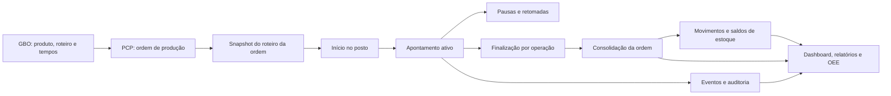
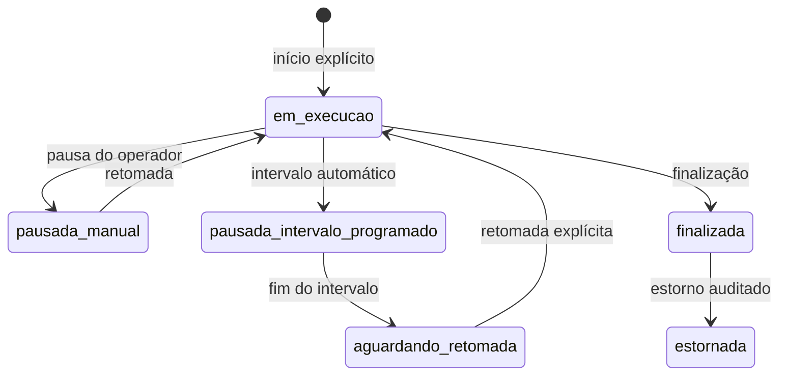
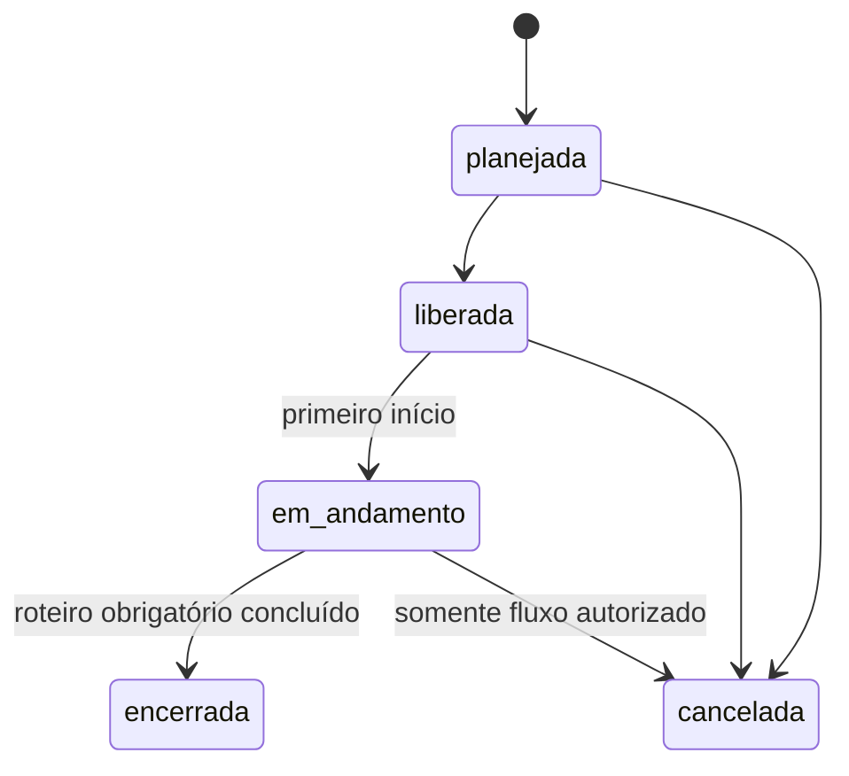

# Mapa do fluxo de dados — Exata ERP

## 1. Visão ponta a ponta

O nó “Snapshot do roteiro da ordem” é o contrato necessário para preservar o histórico. No schema auditado, as funções ainda consultam as operações ativas atuais do produto.

## 2. Matriz de produtores e consumidores

| Informação | Produtor | Persistência | Transformação canônica | Consumidores |
|---|---|---|---|---|
| Empresa e usuário | Auth/admin | `empresas`, `perfis`, `user_roles` | políticas RLS e helpers de permissão | todas as telas e RPCs |
| Produto | GBO | `produtos` | código/empresa e status ativo | PCP, estoque, relatórios |
| Roteiro | GBO | `operacoes`, `operacao_postos` | sequência, tempo, unidade, obrigatoriedade | liberação, apontamento, capacidade |
| Ordem | PCP | `ordens_producao` | quantidade, produto, prazo, status | postos, estoque, dashboards |
| Roteiro/BOM liberados | PCP | ausente no modelo auditado | devem ser snapshots imutáveis | início, progresso, estoque, encerramento |
| Sessão produtiva | operador/RPC | `apontamentos` | estado, cronômetro e quantidades | posto, progresso, OEE, estoque |
| Pausa | operador/agendador | `apontamento_pausas` | intervalos efetivos por motivo | tempo líquido e disponibilidade |
| Evento da ordem | RPC/triggers | `production_order_events` | origem, ator, payload e correlação | auditoria e explicação do estado |
| Movimento | finalização/estorno | `movimentacoes_estoque` | delta idempotente por apontamento | saldo, rastreabilidade, relatórios |
| Saldo | função de estoque | `estoque_saldos` | saldo por item/local/empresa | estoque e disponibilidade |
| OEE | frontend auditado | não persistido | fórmulas duplicadas | relatórios e dashboard |

## 3. Fluxo atual de início

1. A tela de apontamento carrega postos e contexto acessíveis ao usuário.
2. A seleção de posto consulta o estado; não deve iniciar produção.
3. O clique em iniciar chama `public.iniciar_apontamento_no_posto`.
4. A função valida autenticação, empresa, acesso ao posto, máquina ativa, janela de horário, ordem, produto e operação.
5. Uma trava consultiva serializa o usuário e a trigger limita apontamentos ativos conforme o papel.
6. A função insere `apontamentos` como `em_andamento`/`em_execucao` com `cronometro_inicio`.
7. A ordem é movida para execução quando necessário.

Lacunas atuais:

- não há chave idempotente do comando;
- usuários autorizados a múltiplas sessões podem repetir o mesmo contexto;
- não há evento normal de início;
- ordem e operação podem desaparecer depois do início.

## 4. Fluxo atual de finalização

1. `public.finalizar_apontamento_producao` trava o apontamento e a ordem.
2. Valida estado, quantidade, refugo e tempo.
3. Consolida a quantidade produzida da operação.
4. Finaliza ou reabre logicamente o apontamento conforme a meta da operação.
5. `private.recalcular_ordem_producao` calcula o avanço da ordem pela menor quantidade processada/aprovada entre operações obrigatórias.
6. `public.finalizar_apontamento_estoque` movimenta somente o delta ainda não creditado à ordem.
7. Consumo, entrada de produto acabado e eventos ficam vinculados ao apontamento.

Ponto correto: cinco operações de 100 peças não viram 500 peças acabadas; o avanço consolidado é limitado pela etapa menos avançada.

Ponto frágil: as operações obrigatórias vêm do roteiro ativo atual, não de uma versão congelada na ordem.

## 5. Estados oficiais

### Apontamento

Os nomes físicos de `status` e `estado_operacao` ainda coexistem e precisam ser tratados como duas dimensões deliberadas: situação documental e estado operacional. Consumidores não devem inferir atividade apenas por um valor legado de `status`.

### Ordem de produção

O encerramento deve depender do snapshot de operações obrigatórias e da integridade dos apontamentos, nunca apenas de edição direta no frontend.

## 6. Exclusão e retenção

| Entidade | Regra segura |
|---|---|
| Produto | inativar quando já referenciado; excluir apenas sem dependências |
| Operação/roteiro | criar nova versão; manter versões usadas |
| Máquina/posto | inativar quando houver histórico |
| Ordem | cancelar/arquivar; não excluir após liberação ou dependência |
| Apontamento | nunca excluir fisicamente; estornar com motivo, ator e timestamp |
| Movimento de estoque | imutável; compensar com movimento de estorno |
| Evento/auditoria | append-only |

## 7. Fonte de verdade proposta

| Conceito | Fonte de verdade |
|---|---|
| tempo de operação | snapshot da operação na ordem, normalizado em segundos |
| tempo total de uma unidade | soma dos tempos das operações do roteiro |
| gargalo | maior tempo/carga efetiva entre operações ou recursos comparáveis |
| takt | tempo produtivo disponível dividido pela demanda do período |
| peças acabadas | avanço consolidado da ordem, limitado pelas operações obrigatórias |
| tempo líquido | intervalos efetivamente em execução, excluindo pausas válidas |
| OEE | agregação canônica de disponibilidade, desempenho e qualidade por período/recurso |
| saldo | somatório imutável de movimentos, refletido em saldo transacional |

## 8. Pontos de sincronização

O sistema auditado usa polling, não Realtime. Caso Realtime seja habilitado, devem ser publicados apenas os recursos necessários e cada tela deve manter uma única assinatura por empresa/contexto, com cleanup obrigatório. A atualização visual nunca deve substituir validação transacional no banco.
